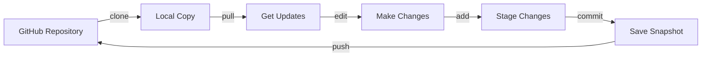

# Git Commands Cheatsheet
# ورقة مرجع أوامر Git

**For**: M110 Python Programming Students | **لـ**: طلاب برمجة بايثون M110
**Focus**: Student Workflow | **التركيز**: سير عمل الطالب

---

## 🎯 Student Git Workflow
## 🎯 سير عمل Git للطلاب



---

## 🚀 Getting Started
## 🚀 البدء

| Command | Purpose | Example |
|---------|---------|---------|
| **Clone repository** / **نسخ المستودع** | | |
| `git clone <url>` | Get course materials / الحصول على مواد المقرر | `git clone https://github.com/instructor/python-m110.git` |
| | | Creates folder `python-m110/` |
| **Check status** / **فحص الحالة** | | |
| `git status` | See what's changed / رؤية التغييرات | Shows modified/new files |

---

## 📥 Getting Updates (Most Important for Students!)
## 📥 الحصول على التحديثات (الأهم للطلاب!)

| Command | Purpose | When to Use |
|---------|---------|-------------|
| **Pull updates** / **سحب التحديثات** | | |
| `git pull origin main` | Get latest from instructor / احصل على آخر التحديثات من المدرس | Every week before class / كل أسبوع قبل الحصة |
| `git pull` | Same (if configured) / نفس الأمر (إذا تم التكوين) | Shorter version / نسخة مختصرة |

⚠️ **Important**: Always pull before starting work!
⚠️ **مهم**: اسحب التحديثات دائماً قبل بدء العمل!

---

## 📋 Viewing History
## 📋 عرض السجل

| Command | Purpose | Output Example |
|---------|---------|----------------|
| **View commits** / **عرض الالتزامات** | | |
| `git log` | See full history / عرض السجل الكامل | Detailed commit info |
| `git log --oneline` | Compact history / سجل مختصر | `a1b2c3d Added week 3 exercises` |
| `git log -3` | Last 3 commits / آخر 3 التزامات | Shows recent changes |
| **See changes** / **رؤية التغييرات** | | |
| `git diff` | What changed? / ما الذي تغير؟ | Shows line-by-line changes |
| `git diff <file>` | Changes in specific file / تغييرات في ملف محدد | `git diff homework.py` |

---

## 🌿 Branches (Optional/Advanced)
## 🌿 الفروع (اختياري/متقدم)

| Command | Purpose | Example |
|---------|---------|---------|
| **List branches** / **قائمة الفروع** | | |
| `git branch` | See all branches / رؤية جميع الفروع | `* main` (current branch) |
| **Create branch** / **إنشاء فرع** | | |
| `git checkout -b <name>` | New branch for your work / فرع جديد لعملك | `git checkout -b my-solution` |
| **Switch branch** / **تبديل الفرع** | | |
| `git checkout <name>` | Change to different branch / التغيير لفرع مختلف | `git checkout main` |

---

## 💾 Saving Your Work (Optional for Students)
## 💾 حفظ عملك (اختياري للطلاب)

| Command | Purpose | Example |
|---------|---------|---------|
| **Stage files** / **تجهيز الملفات** | | |
| `git add <file>` | Prepare file for commit / تحضير ملف للالتزام | `git add homework.py` |
| `git add .` | Stage all changes / تجهيز جميع التغييرات | Adds everything |
| **Commit** / **الالتزام** | | |
| `git commit -m "message"` | Save snapshot / حفظ لقطة | `git commit -m "Completed exercise 3"` |
| **Push** / **دفع** | | |
| `git push origin <branch>` | Upload to GitHub / رفع إلى GitHub | `git push origin my-solution` |

---

## 🔧 Fixing Common Issues
## 🔧 حل المشاكل الشائعة

### Problem 1: "Your branch is behind"
### المشكلة 1: "فرعك متأخر"
```bash
git pull origin main
```

### Problem 2: "Merge conflicts"
### المشكلة 2: "تضارب الدمج"
```bash
# Option 1: Keep instructor's version / احتفظ بنسخة المدرس
git checkout --theirs <file>
git add <file>
git commit -m "Resolved conflict"

# Option 2: Keep your version / احتفظ بنسختك
git checkout --ours <file>
git add <file>
git commit -m "Resolved conflict"
```

### Problem 3: "Uncommitted changes"
### المشكلة 3: "تغييرات غير ملتزمة"
```bash
# Save changes temporarily / حفظ التغييرات مؤقتاً
git stash

# Pull updates / سحب التحديثات
git pull

# Restore your changes / استعادة تغييراتك
git stash pop
```

### Problem 4: "Wrong commit message"
### المشكلة 4: "رسالة التزام خاطئة"
```bash
# Fix last commit message / تصحيح آخر رسالة التزام
git commit --amend -m "New message"
```

---

## 📁 Repository Navigation
## 📁 التنقل في المستودع

| Command | Purpose | Example |
|---------|---------|---------|
| **Where am I?** / **أين أنا؟** | | |
| `pwd` | Current directory / المجلد الحالي | `/Users/student/python-m110` |
| **List files** / **قائمة الملفات** | | |
| `ls` | See files / رؤية الملفات | Shows all files/folders |
| `ls -la` | Detailed list / قائمة مفصلة | Shows hidden files too |
| **Change directory** / **تغيير المجلد** | | |
| `cd <folder>` | Enter folder / دخول المجلد | `cd exercises/week-03` |
| `cd ..` | Go back / الرجوع | Up one level |
| `cd ~` | Home directory / المجلد الرئيسي | Your user folder |

---

## 🎨 Git Configuration (One-time Setup)
## 🎨 إعداد Git (مرة واحدة)

```bash
# Set your name / اضبط اسمك
git config --global user.name "Your Name"

# Set your email / اضبط بريدك الإلكتروني
git config --global user.email "your.email@example.com"

# Check settings / تحقق من الإعدادات
git config --list
```

---

## 📚 Student Workflow Example
## 📚 مثال سير عمل الطالب

```bash
# 1. First time: Clone the course repository
# المرة الأولى: نسخ مستودع المقرر
git clone https://github.com/instructor/python-m110.git
cd python-m110

# 2. Every week: Get updates
# كل أسبوع: احصل على التحديثات
git pull origin main

# 3. Work on exercises
# اعمل على التمارين
cd exercises/week-03
python exercise1.py

# 4. (Optional) Save your work
# (اختياري) احفظ عملك
git add exercise1.py
git commit -m "Completed exercise 1"

# 5. Check what you've done
# تحقق مما فعلته
git status
git log --oneline
```

---

## ⚡ Quick Reference
## ⚡ مرجع سريع

| Task | Command |
|------|---------|
| **Get course materials** / **احصل على مواد المقرر** | `git clone <url>` |
| **Get weekly updates** / **احصل على التحديثات الأسبوعية** | `git pull origin main` |
| **Check what changed** / **تحقق من التغييرات** | `git status` |
| **View history** / **عرض السجل** | `git log --oneline` |
| **See differences** / **رؤية الاختلافات** | `git diff` |

---

## ✅ Best Practices for Students
## ✅ أفضل الممارسات للطلاب

- 📥 **Pull frequently**: Get updates before each class
  **اسحب بكثرة**: احصل على التحديثات قبل كل حصة

- 📝 **Make copies**: Work on copies of exercise files
  **اصنع نسخ**: اعمل على نسخ من ملفات التمارين

- 🌿 **Use branches**: Create your own branch for solutions
  **استخدم الفروع**: أنشئ فرعك الخاص للحلول

- 💾 **Commit often**: Save your progress regularly
  **التزم بكثرة**: احفظ تقدمك بانتظام

- 📋 **Write clear messages**: "Finished homework 3" not "stuff"
  **اكتب رسائل واضحة**: "أنهيت الواجب 3" وليس "أشياء"

---

## 🆘 Getting Help
## 🆘 الحصول على المساعدة

- **Git documentation**: https://git-scm.com/doc
- **GitHub guides**: https://guides.github.com
- **Interactive tutorial**: https://learngitbranching.js.org
- **Ask instructor during office hours!**
  **اسأل المدرس خلال الساعات المكتبية!**

---

**📌 Keep this handy when working with Git!**
**📌 احتفظ بهذا عند العمل مع Git!**

---

*M110 Python Programming - Arab Open University, Amman*
*برمجة بايثون M110 - الجامعة العربية المفتوحة، عمان*